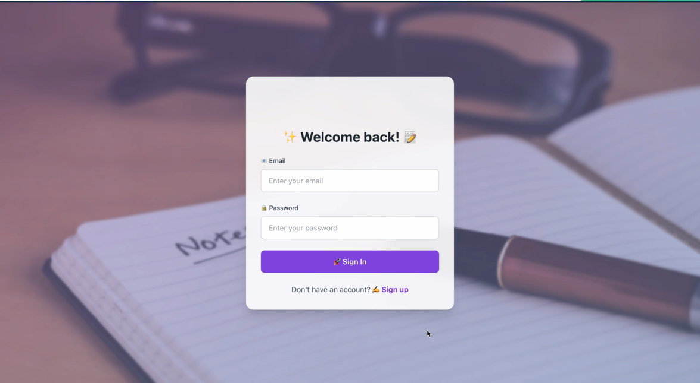

# NoteSense

## [Demo Video](https://youtu.be/PuIh7Fri-Zk)

[](https://youtu.be/PuIh7Fri-Zk)

Watch a quick walkthrough of NoteSense's key features, showcasing its intuitive interface, note management capabilities, and AI-powered enhancements.

**Note**: To view the demo, download the `Demo.mov` file from the repository.

NoteSense is a next-generation note-taking application designed for effortless organization, seamless collaboration, and AI-powered enhancements. Whether you're a student, professional, or creative thinker, NoteSense transforms the way you capture and manage information. By blending the best features of apps like Evernote and OneNote while addressing common frustrations like cluttered interfaces and poor searchability, NoteSense offers a streamlined and intuitive experience.

## Key Features

- **Secure Authentication**: Register and log in with ease, ensuring your notes remain private and protected.
- **Powerful Note Management**:
  - Create, edit, and delete notes effortlessly.
  - Categorize notes for structured organization.
- **Rich Multimedia Support**:
  - Attach images and record audio notes.
  - Leverage voice-to-text and handwriting recognition for flexible input.
- **Intelligent Search**:
  - Find notes instantly with an advanced search algorithm.
- **Dynamic Visualizations**:
  - Mind maps for conceptual clarity.
  - Kanban boards for workflow optimization.
- **AI-Driven Capabilities**:
  - Auto-generate summaries for quick insights.
  - Smart tagging based on content context.

## Tech Stack

### **Frontend**
- React with TypeScript for a responsive UI.
- Framer Motion for smooth animations.
- Axios for efficient API communication.
- React Beautiful DnD for intuitive drag-and-drop interactions.

### **Backend**
- Go with GORM for robust ORM handling.
- PostgreSQL for reliable data storage.
- JSONB for flexible, schema-free content management.

## Getting Started

### **Prerequisites**
- Node.js (v14 or higher)
- Go (v1.16 or higher)
- PostgreSQL (v12 or higher)

### **Installation & Setup**

#### **Clone the Repository**
```bash
  git clone https://github.com/tarunngusain08/NoteSense.git
  cd NoteSense
```

#### **Frontend Setup**
```bash
  cd frontend
  npm install  # Install dependencies
  npm run dev    # Launch the frontend
```

#### **Backend Setup**
```bash
  cd ../backend
  go mod tidy   # Install Go dependencies
```
- Configure PostgreSQL connection in the `.env` file.
- Start the backend server:
```bash
  go run main.go
```

#### **Postgres Setup**
Install the Postgres for your machine. And run the below commands
```bash
  psql -U postgres -c "CREATE DATABASE NoteSense;"
  psql -U postgres -c "CREATE USER postgres WITH PASSWORD 'your_password';"
  psql -U postgres -c "GRANT ALL PRIVILEGES ON DATABASE NoteSense TO postgres;"
```

**Environment Variables**

**Make sure your .env file is configured as follows:**
```bash
  DB_USER=postgres    
  DB_PASSWORD=your_password
  DB_NAME=NoteSense
  DB_HOST=localhost
  DB_PORT=5432
  JWT_SECRET=your_secret_key
  PYTHON_VENV_PATH="/Users/radhakrishna/GolandProjects/NoteSense/backend/scripts/venv/bin/python"
```

### **Running the Application**
- Access the frontend at **http://localhost:3000**.
- The backend API runs at **http://localhost:8080**.


### **Setting and Running the App with docker-compose**
```bash
  docker-compose down
  docker-compose up --build
```
- Access the frontend at **http://localhost** 
- The backend API runs at **http://localhost:8080**

## Contributing
We welcome contributions! Follow these steps:
1. Fork the repository.
2. Create a new branch:
   ```bash
   git checkout -b feature/YourFeature
   ```
3. Implement changes and commit:
   ```bash
   git commit -m "Add new feature"
   ```
4. Push your branch:
   ```bash
   git push origin feature/YourFeature
   ```
5. Open a **Pull Request** for review.

## License
This project is licensed under the **MIT License**. See the `LICENSE` file for details.

## Acknowledgments
- Inspired by top-tier note-taking applications.
- Thanks to the contributors and the open-source community for their support.

---

🚀 Get started with NoteSense today and redefine your note-taking experience!

